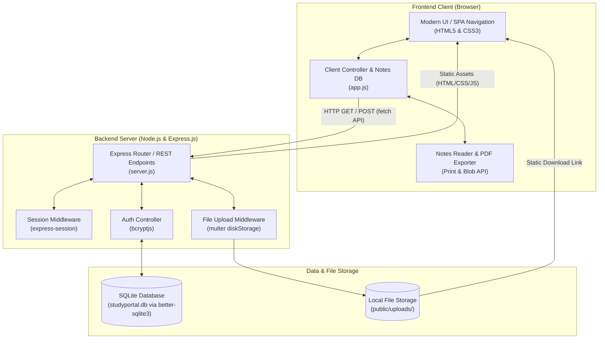
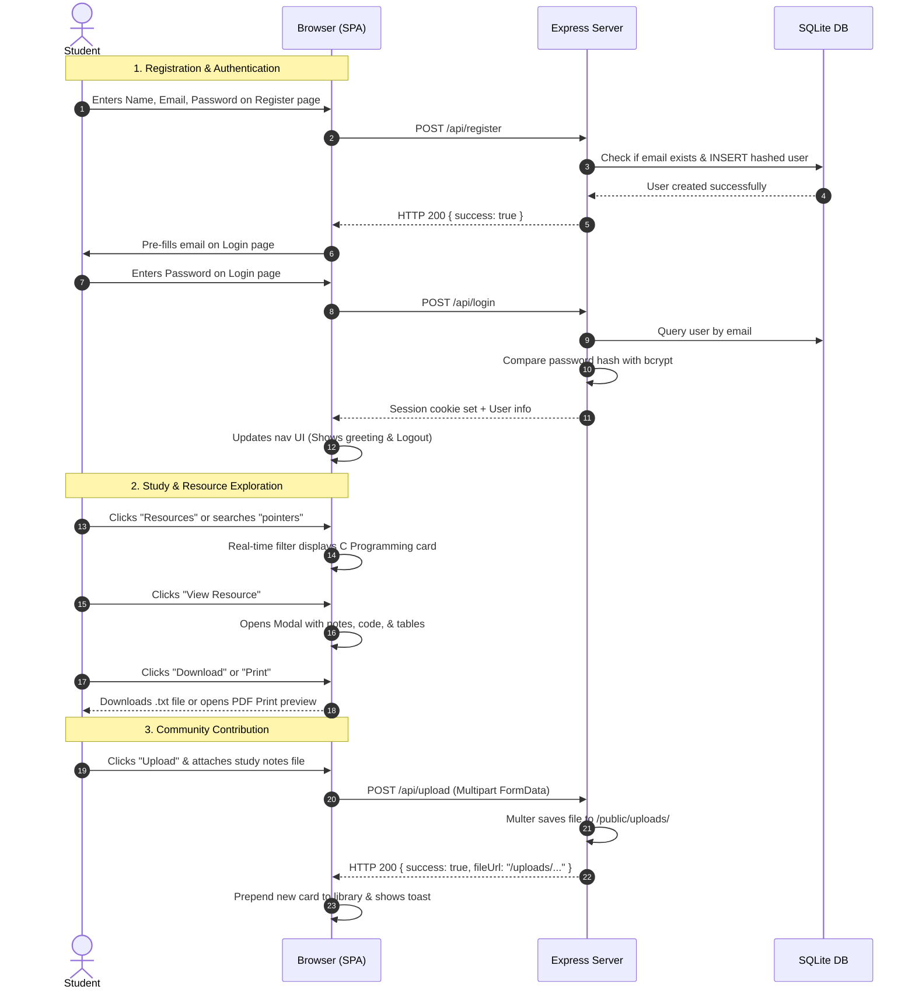

# 📚 Student Study Resource Portal

> **A Modern, All-in-One Academic Learning Hub and Study Resource Management System for College Students.**

[](https://nodejs.org/)
[](https://expressjs.com/)
[-003B57?logo=sqlite&logoColor=white)](https://www.sqlite.org/)
[-E34F26?logo=html5&logoColor=white)](https://developer.mozilla.org/)
[](#)

---

## 📑 Table of Contents

1. [Project Title](#1-project-title)
2. [Project Overview](#2-project-overview)
3. [Problem Statement](#3-problem-statement)
4. [Objectives](#4-objectives)
5. [Key Features](#5-key-features)
6. [User Modules](#6-user-modules)
   - [Home Module](#-home-module)
   - [Resources Module](#-resources-module)
   - [Upload Module](#-upload-module)
   - [AI Search Module](#-ai-search-module)
   - [Admin Module](#-admin-module)
   - [Login & Register Module](#-login--register-module)
7. [Resource Management](#7-resource-management)
   - [C Programming Basics](#-c-programming-basics)
   - [Comprehensive Syllabus Notes](#-comprehensive-syllabus-notes)
   - [Interactive View Resource Modal](#-interactive-view-resource-modal)
   - [Downloadable PDF & Text Formats](#-downloadable-pdf--text-formats)
8. [Technology Stack](#8-technology-stack)
9. [System Architecture](#9-system-architecture)
10. [Frontend Description](#10-frontend-description)
11. [Backend Description](#11-backend-description)
12. [Database Description](#12-database-description)
13. [How the Application Works](#13-how-the-application-works)
14. [Project Folder Structure](#14-project-folder-structure)
15. [Installation and Setup Steps](#15-installation-and-setup-steps)
16. [How to Run the Project Locally](#16-how-to-run-the-project-locally)
17. [Deployment Information](#17-deployment-information)
18. [Advantages](#18-advantages)
19. [Future Enhancements](#19-future-enhancements)
20. [Conclusion](#20-conclusion)

---

## 1. Project Title

### **Student Study Resource Portal** *(StudyPortal Pro)*

A web-based learning management and study material sharing platform developed specifically for engineering and college students. It provides a centralized repository of syllabus-aligned lecture notes, runnable code snippets, instant search, peer uploads, and student account authentication.

---

## 2. Project Overview

During academic semesters and examination periods, college students frequently encounter fragmented learning resources. Quality study materials, code samples, and revision summaries are often scattered across messaging groups, personal drives, and physical paper notes.

The **Student Study Resource Portal** solves this issue by offering a clean, unified, and responsive Single-Page Application (SPA) web portal. Students can:
- Read structured, exam-oriented study materials across core Computer Science and Engineering subjects (C Programming, Java, Python, Web Development, and Cloud Computing).
- Study interactive, formatted code examples with one-click copy functionality.
- Download revision notes as offline text files or export them directly as formatted PDFs via browser print integration.
- Upload and contribute their own revision notes, cheat sheets, and lab files directly to the server.
- Query syllabus concepts using an AI Study Search engine with interactive search chips.
- Create secure student accounts with encrypted passwords to access protected upload and administrative features.

---

## 3. Problem Statement

In most higher education institutions, students face significant obstacles when preparing for exams and lab practicals:

1. **Scattered Resources:** Important reference notes and lab programs are distributed across chat groups (WhatsApp, Telegram), email threads, and personal cloud drives, resulting in lost files and wasted preparation time.
2. **Inconsistent Quality:** Unverified notes often contain syntactical bugs, incomplete explanations, or outdated syllabus concepts.
3. **Friction in Sharing:** Contributing notes to classmates requires manual file forwarding, with no centralized archive or categorization.
4. **Poor Mobile Reading Experience:** Standard PDF scans or raw word processor documents are bulky, hard to search on mobile screens, and difficult to study from during transit.
5. **Lack of Instant Topic Search:** Finding a specific topic (e.g., *"C pointers memory swap"* or *"CSS Flexbox vs Grid"*) requires opening dozens of multi-page documents.

---

## 4. Objectives

The primary objectives of the **Student Study Resource Portal** are:

- **Centralize Learning Materials:** Provide a single, trustworthy repository for engineering and programming subject notes.
- **Enhance Study Efficiency:** Deliver structured, high-yield summaries that break down complex technical topics into easy-to-understand points, comparison tables, and code snippets.
- **Enable Peer Contribution:** Allow authenticated students to upload study files (PDFs, text files, code solutions) and publish them to the community library.
- **Provide Quick Revision Tools:** Enable one-click copy, text file downloading, and print-to-PDF export directly inside the browser.
- **Deliver Fast Conceptual Retrieval:** Implement an AI Search interface where students can type natural technical queries and immediately retrieve relevant syllabus sections.
- **Ensure Account Security:** Implement secure student registration and session-based login using industry-standard password hashing (`bcryptjs`).
- **Support Responsive Design:** Ensure the entire portal operates smoothly across desktop monitors, laptops, tablets, and smartphones.

---

## 5. Key Features

| Feature | Category | Description | Status |
| :--- | :--- | :--- | :--- |
| **Instant Notes Viewer Modal** | Learning | Full-screen interactive reader with summary callouts, data type tables, and code snippets. | ✅ Implemented |
| **Download & Print Notes** | Productivity | One-click `.txt` download using HTML5 Blob and formatted print-to-PDF via `window.print()`. | ✅ Implemented |
| **One-Click Code Copy** | Usability | Dedicated copy button on code snippets with animated visual clipboard feedback. | ✅ Implemented |
| **Live Subject & Keyword Filter** | Navigation | Dual filtering via real-time search input and interactive subject filter chips. | ✅ Implemented |
| **File Upload System** | Contribution | Authenticated file upload with Express `multer` disk storage in `public/uploads/`. | ✅ Implemented |
| **AI Study Search Engine** | Discovery | Fast multi-field query matcher with pre-set suggestion chips for common exam topics. | ✅ Implemented |
| **Admin Moderation Panel** | Management | Administrative dashboard to review, approve, or reject student-submitted materials. | ✅ Implemented |
| **Secure Authentication** | Security | Registration and login backed by SQLite database, `bcryptjs` hashing, and express sessions. | ✅ Implemented |
| **Protected Feature Routing** | Access Control | Automatic login prompts when unauthenticated users try to upload or open admin panel. | ✅ Implemented |
| **Responsive Dark-Accented Theme** | UI/UX | Custom CSS design system with glassmorphism, gradient accents, and mobile navigation. | ✅ Implemented |

---

## 6. User Modules

The application is structured into six intuitive modules, accessible via the top navigation bar.

```
┌────────────────────────────────────────────────────────────────────────┐
│                        MAIN NAVIGATION BAR                             │
│  [🏠 Home]  [📚 Resources]  [📤 Upload*]  [🤖 AI Search]  [🛠️ Admin*]  │
│                                           [* Requires Student Login]   │
└────────────────────────────────────────────────────────────────────────┘
```

### 🏠 Home Module
The welcome page introduces students to the portal:
- **Hero Section:** Academic banner highlighting the 2026 Academic Year Resource Hub, call-to-action buttons (*"Explore Resources"* and *"Try AI Study Search"*), and feature highlight pills (*Instant Access*, *Exam-Oriented Notes*, *Runnable Code Snippets*, *Peer Collaboration*).
- **Core Feature Cards:** Clickable cards redirecting students directly to Resources, Upload, and AI Search.
- **Live Statistics Row:** Displays platform metrics including verified resources count, core subjects, and total student reads.

### 📚 Resources Module
The heart of the learning portal:
- **Search Bar:** Real-time search input that filters resources by title, keywords, or topics (e.g., `pointers`, `flexbox`, `oop`, `aws`).
- **Subject Filter Dropdown & Chips:** Filter resources instantly by subject (`C Programming`, `Web Development`, `Cloud Computing`, `Java`, `Python`, or `All Subjects`).
- **Resource Cards Grid:** Displays metadata pills (reading time, subject badge), topic hashtags, resource overview, and an interactive **"📖 View Resource"** button.

### 📤 Upload Module *(Protected)*
Allows authenticated students to contribute study resources:
- Input fields for **Resource Title**, **Subject selection**, and **Description/Summary**.
- **File Chooser:** Accepts study notes files (PDF, text notes, or code files) up to 25 MB.
- Backend integration via `multer` saves the file into `public/uploads/` with a unique timestamped filename.
- Automatically creates a new resource card and adds the notes to the active library instantly.
- *Protected Route:* If an unauthenticated user attempts to open Upload, they receive a notification toast and are safely directed to the Login screen.

### 🤖 AI Search Module
Designed for quick conceptual query resolution:
- **Natural Language Search Input:** Students can enter technical questions (e.g., *"How do pointers work in C?"*, *"Explain Flexbox vs Grid"*, or *"Java OOP"*).
- **Interactive Suggestion Chips:** One-click topic chips (*"Explain C loops"*, *"pointers"*, *"Flexbox vs Grid"*, *"Java OOP"*, *"Python comprehensions"*, *"AWS EC2"*).
- **Matching Algorithm:** Scans the notes database across titles, subjects, summaries, and full content to return matching cards with reading times and direct *"Read Full Notes"* actions.

### 🛠️ Admin Module *(Protected)*
A control dashboard designed for resource moderation:
- **Metric Cards:** Displays published resources count, pending review counter, and system health status.
- **Moderation Queue:** Sample community submission card displaying submitted file metadata and author information.
- **Action Buttons:** Interactive **"✓ Approve & Publish"** and **"✕ Reject"** buttons that dynamically update card states and pending review counters.
- *Protected Route:* Requires student login to access.

### 🔐 Login & Register Module
Manages student account creation and session state:
- **Register Form:** Accepts Full Name, College/Personal Email, and Password (minimum 6 characters). Hashes the password using `bcryptjs` and stores the user in SQLite.
- **Login Form:** Validates email and password, creates an active server session, stores user details in `sessionStorage`, and redirects the student to the Home page.
- **Dynamic Header UI:** Upon login, auth links (*Login / Register*) are replaced with a student greeting badge (`Student Name`) and a **Logout** button.
- **Logout Action:** Calls `/api/logout`, clears session cookies and local storage, and securely returns the user to the login screen.

---

## 7. Resource Management

The portal includes curated, academically verified study notes with ready-to-study curriculum content.

### 💻 C Programming Basics
The flagship learning module covers fundamental systems programming concepts:
- **Compilation Model:** Detailed breakdown of Preprocessing (`#include`), Compilation, Assembly (object code generation), and Linking.
- **Fundamental Data Types:** A clear reference table for `int`, `float`, `double`, and `char` specifying byte sizes, format specifiers (`%d`, `%f`, `%lf`, `%c`), and value ranges.
- **Control Flow:** Explanations of `if/else`, `switch-case`, `for`, `while`, and `do-while` loops, along with `break` and `continue`.
- **Pointers & Memory Architecture:** Clear explanations of the address-of operator (`&`), dereference operator (`*`), and dynamic memory allocation (`malloc`, `calloc`, `realloc`, `free`).
- **Complete Runnable Code Snippet:** `c_pointers_example.c` illustrating pass-by-reference pointer swapping and dynamic array allocation.
- **Exam Traps & Warnings:** Callout box highlighting dangling pointers, memory leaks, and array out-of-bounds risks.

### 📖 Comprehensive Syllabus Notes
In addition to C Programming, the portal comes pre-loaded with verified notes across four other disciplines:
1. **Web Development (`web-dev`):** Semantic HTML5 elements (`<article>`, `<section>`, `<nav>`), CSS Box Model (`content`, `padding`, `border`, `margin`), 1D Flexbox vs. 2D CSS Grid comparative table, and responsive CSS card container snippets.
2. **Cloud Computing (`aws-cloud`):** Cloud service models (IaaS, PaaS, SaaS), AWS global infrastructure (Regions, Availability Zones, Edge Locations), core services (EC2, S3, RDS, DynamoDB, Lambda, VPC), and IAM security best practices with sample JSON policies.
3. **Java Programming (`java-oop`):** The 4 pillars of OOP (Encapsulation, Inheritance, Polymorphism, Abstraction), abstract classes and subclass implementation, Java Collections Framework table (`List`, `Set`, `Map`), and exception handling with `try-catch-finally`.
4. **Python Essentials (`python-core`):** Core data structures (Lists, Tuples, Sets, Dictionaries) with mutability rules, list and dictionary comprehensions, safe file I/O with `with` context managers, and `*args`/`**kwargs` function arguments.

### 🔍 Interactive View Resource Modal
Clicking **"📖 View Resource"** on any card opens the dedicated Notes Reader Modal:
- Displays subject tag, estimated reading time, and target skill level (*Beginner*, *Intermediate*, *All Levels*).
- Formatted sections with custom callout boxes, styled HTML tables, and syntax-styled code containers.
- Code blocks feature a dedicated **"Copy Code"** button for quick pasting into local IDEs.
- Includes backdrop dismiss, close button, and keyboard `Esc` listener.

### 📄 Downloadable PDF & Text Formats
Students can study offline or print study sheets using built-in export tools:
- **Download Notes (`⬇️ Download`):** Assembles the note title, subject, metadata, overview, and clean text content into a formatted text file (`[resourceId]-study-notes.txt`) and downloads it via the browser using HTML5 Blob.
- **Copy Notes (`📋 Copy Notes`):** Copies the full document text directly to the system clipboard.
- **Print / Save as PDF (`🖨️ Print`):** Invokes the browser's native print engine (`window.print()`). The project includes custom CSS `@media print` rules that hide navigation bars, footers, and modal action buttons, generating a clean, multipage academic PDF document.

---

## 8. Technology Stack

The project is built entirely on modern, standard web technologies without heavy frontend frameworks, ensuring maximum performance, zero build-step overhead, and ease of understanding for students.

```
┌─────────────────────────────────────────────────────────────┐
│                      TECHNOLOGY STACK                       │
├──────────────────────────┬──────────────────────────────────┤
│ Frontend Structure       │ HTML5 (Semantic Markup)          │
│ Frontend Styling         │ Vanilla CSS3 (Custom Tokens)     │
│ Frontend Scripting       │ Vanilla JavaScript (ES6+ Native) │
│ Server Runtime           │ Node.js (v18.x to v24.x)         │
│ Backend Framework        │ Express.js (v5.1.0)              │
│ Embedded Database        │ SQLite (via better-sqlite3)      │
│ Password Security        │ bcryptjs (v2.4.3)                │
│ Session Management       │ express-session (v1.18.2)        │
│ File Upload Handling     │ multer (v2.0.0)                  │
└──────────────────────────┴──────────────────────────────────┘
```

### Detailed Breakdown of Technologies

- **HTML5:** Provides semantic page layout (`<header>`, `<nav>`, `<section>`, `<article>`, `<footer>`, `<dialog>` style modals).
- **CSS3:** Built using custom CSS variables (design tokens for colors, spacing, borders, shadows), responsive CSS Grid and Flexbox layouts, modern glassmorphism backdrops, and dedicated print stylesheets (`@media print`).
- **JavaScript (Client):** Pure ES6+ JavaScript handling single-page navigation, DOM event listeners, modal rendering, search algorithms, and asynchronous `fetch()` API calls.
- **Node.js:** Server-side JavaScript runtime environment executing asynchronous, non-blocking I/O operations.
- **Express.js (v5):** Fast, minimalist web framework providing RESTful API endpoints, request parsing middleware (`express.json`, `express.urlencoded`), and static asset serving.
- **better-sqlite3:** High-performance, synchronous SQLite3 binding for Node.js. It stores data in a single file (`studyportal.db`), eliminating the need to install or configure external database servers like MySQL or PostgreSQL.
- **bcryptjs:** Industry-standard password hashing library implementing adaptive salt hashing to prevent plaintext credential exposure and rainbow table attacks.
- **express-session:** Session middleware managing server-side user sessions via encrypted cookie identifiers.
- **multer:** Specialized Node.js middleware for handling `multipart/form-data`, responsible for streaming uploaded study files into the `public/uploads/` directory with size limits and timestamped unique names.

---

## 9. System Architecture

The Student Study Resource Portal utilizes a 3-tier client-server-database architecture:



### Client-Server Communication Flow
1. **User Request:** The client browser sends HTTP requests via the browser's `fetch()` API for authentication, session verification, and file uploads.
2. **Server Middleware:** Express processes incoming JSON or `multipart/form-data`, validates input payloads, checks session state, and forwards data to database queries.
3. **Data Access:** Prepared SQL statements query or update the local `studyportal.db` file synchronously with sub-millisecond latency.
4. **File Handling:** Uploaded study notes pass through `multer` disk storage and are assigned sanitized, timestamped filenames in `public/uploads/`.
5. **Client Response:** The server responds with structured JSON data (`{ success: true, user: {...} }`), which the client uses to dynamically update the UI without reloading the page.

---

## 10. Frontend Description

The frontend is constructed as a modern, lightweight Single-Page Application (SPA).

- **Page Routing (`showPage`):** Instead of refreshing the browser or requesting new HTML documents from the server, client-side JavaScript manages views by toggling active CSS display states on `<section class="page">` elements.
- **Design System & Aesthetics:**
  - Modern typography powered by Google Fonts: **Outfit** (headings), **Plus Jakarta Sans** (body text), and **JetBrains Mono** (code snippets).
  - Curated color palette: Deep navy slate backgrounds (`#0a0f1d`), indigo-violet primary gradients (`#4f46e5` to `#7c3aed`), emerald success tones (`#10b981`), and subtle border highlights.
  - Interactive micro-interactions: Smooth hover lifts (`translateY(-5px)`), card glow effects, and pulse animations.
- **Search & Filter Subsystem:** Real-time event listeners on the search input (`input` event) and subject dropdown/chips (`change` and `click` events) evaluate each resource card's attributes and update visibility in real time.
- **Modal Component:** Injects dynamic HTML content from the `STUDY_NOTES_DB` JavaScript data store into a floating dialog with smooth background blurs and scroll locking on `document.body`.
- **Toast Notifications:** A non-intrusive floating feedback component informs users of actions like successful logins, copied code snippets, or upload confirmations.

---

## 11. Backend Description

The backend is implemented in `server.js` using Express.js and structured RESTful routing.

### Core Middleware Stack
- `express.json()` & `express.urlencoded({ extended: true })`: Parses incoming JSON payloads and URL-encoded form submissions.
- `express.static()`: Serves all static frontend assets directly from `public/` and uploaded documents from `public/uploads/`.
- `express-session`: Configures secure, HTTP cookie-based session tracking with secret signing.
- `multer.diskStorage`: Intercepts file uploads, enforces a 25 MB file limit, and saves files with unique names (`resource-[timestamp]-[random].[ext]`).

### REST API Endpoints

| Method | Endpoint | Description | Protected? | Request Body / Payload | Response |
| :--- | :--- | :--- | :---: | :--- | :--- |
| `GET` | `/` | Serves the main SPA index page | No | None | `index.html` |
| `GET` | `/api/test` | Verifies backend connectivity | No | None | `{ message: "..." }` |
| `POST` | `/api/register` | Registers a new student | No | `{ name, email, password }` | `{ success: true, user: {...} }` |
| `POST` | `/api/login` | Authenticates student & sets session | No | `{ email, password }` | `{ success: true, user: {...} }` |
| `GET` | `/api/session` | Checks active session status | No | None | `{ loggedIn: boolean, user?: {...} }` |
| `POST` | `/api/logout` | Destroys session & clears cookie | No | None | `{ success: true }` |
| `POST` | `/api/upload` | Handles study file upload via multer | Yes (UI) | `FormData(title, subject, desc, resourceFile)` | `{ success: true, resource: {...} }` |

---

## 12. Database Description

The application utilizes **SQLite** through the `better-sqlite3` library. The database file is located at `studyportal.db` in the project root.

### Why SQLite?
- **Zero Configuration:** No external database server process, username, password, or port configuration required.
- **Embedded & Portable:** The complete database resides in a single cross-platform file, making it effortless to run locally or share in student evaluations.
- **High Performance:** `better-sqlite3` executes statements synchronously in C++, outperforming asynchronous drivers for desktop and local deployments.

### Database Schema

The database schema is initialized automatically in `database.js` on server startup:

```sql
CREATE TABLE IF NOT EXISTS users (
    id INTEGER PRIMARY KEY AUTOINCREMENT,
    name TEXT NOT NULL,
    email TEXT UNIQUE NOT NULL,
    password TEXT NOT NULL
);
```

### Table Structure: `users`

| Column | Data Type | Constraints | Description |
| :--- | :--- | :--- | :--- |
| `id` | `INTEGER` | `PRIMARY KEY AUTOINCREMENT` | Unique identifier for each student |
| `name` | `TEXT` | `NOT NULL` | Student's full name (e.g., Alex Johnson) |
| `email` | `TEXT` | `UNIQUE NOT NULL` | Student email address (case-insensitive indexed) |
| `password` | `TEXT` | `NOT NULL` | One-way salted hash generated via `bcryptjs` |

### Prepared Statements & Safety
To guarantee high performance and protect against **SQL Injection**, queries use pre-compiled statements:
- `getByEmail`: `SELECT * FROM users WHERE LOWER(email) = LOWER(?)`
- `insert`: `INSERT INTO users (name, email, password) VALUES (?, ?, ?)`
- `updatePassword`: `UPDATE users SET password = ? WHERE id = ?`

---

## 13. How the Application Works

Here is the step-by-step user lifecycle through the portal:



---

## 14. Project Folder Structure

A clean overview of the workspace files and their responsibilities:

```
student-study-resource-portal/
│
├── public/                     # Static client-side frontend files
│   ├── index.html              # Main Single-Page Application HTML document
│   ├── style.css               # Complete design system, layouts & print styles
│   ├── app.js                  # Client controller, notes database, SPA routing
│   └── uploads/                # Directory for student-uploaded files (multer)
│       └── resource-*.txt      # Uploaded study notes and files
│
├── database.js                 # SQLite database initialization & schema setup
├── server.js                   # Node.js Express server, REST APIs & sessions
├── studyportal.db              # SQLite embedded database file (users table)
├── package.json                # Project dependencies, metadata & run scripts
├── package-lock.json           # Exact dependency lockfile
└── README.md                   # Complete project documentation
```

### Key Files at a Glance
- `server.js`: Configures the Express app, sets up `multer` storage in `public/uploads`, defines authentication routes (`/api/register`, `/api/login`, `/api/session`, `/api/logout`), and starts the HTTP server.
- `database.js`: Connects to `studyportal.db` using `better-sqlite3`, ensures the `users` table exists, and handles graceful process cleanup.
- `public/index.html`: Houses the HTML structure for all 6 pages (Home, Resources, Upload, AI Search, Admin, Login/Register), the navigation header, footer, and the notes reader modal.
- `public/style.css`: Contains CSS rules, modern variables, typography styling, responsive media queries, and the `@media print` rules for PDF generation.
- `public/app.js`: Encapsulates `STUDY_NOTES_DB`, authentication helpers, modal manipulation, search and filter logic, upload handling, and admin panel interactions.

---

## 15. Installation and Setup Steps

Follow these simple steps to install and prepare the portal on your computer.

### Prerequisites
Ensure you have the following installed on your machine:
- **Node.js**: Version `18.x`, `20.x`, `22.x`, or `24.x` ([Download Node.js](https://nodejs.org/))
- **npm** (Node Package Manager): Bundled automatically with Node.js
- Modern Web Browser: Google Chrome, Mozilla Firefox, Microsoft Edge, or Safari

### Step 1: Clone or Download the Project
Download the repository files or unzip the project folder into your desired directory:
```bash
cd "student-study-resource-portal"
```

### Step 2: Install Project Dependencies
Open your command prompt or terminal in the project root directory and run:
```bash
npm install
```
This command installs all required packages:
- `express`: Web server framework
- `better-sqlite3`: SQLite database engine
- `bcryptjs`: Password hashing
- `express-session`: Session handling
- `multer`: File upload engine

---

## 16. How to Run the Project Locally

### Running the Standard Server
In your terminal, run:
```bash
npm start
```
*Alternatively:* `node server.js`

### Running in Development Mode (Live Watch)
If you are developing or making code changes, use Node.js's built-in file watcher:
```bash
npm run dev
```

### Accessing the Web Application
Once the server starts, you will see the following terminal output:
```
Database connected successfully!
Users table created!
Server running at http://localhost:3000
```
Open your web browser and navigate to:
```
http://localhost:3000
```

---

## 17. Deployment Information

The portal is designed for simple deployment to modern cloud platforms without requiring specialized container setups.

### Deploying to Render / Railway / Heroku

1. **Environment Variables:**
   - `PORT`: Set automatically by cloud providers (defaults to `3000` in code: `process.env.PORT || 3000`).
   - `NODE_ENV`: Set to `production`.

2. **Build & Start Commands:**
   - **Build Command:** `npm install`
   - **Start Command:** `node server.js`

3. **Persistent Disk Note:**
   - SQLite (`studyportal.db`) and uploaded files (`public/uploads/`) reside on the local filesystem. For production deployments with ephemeral containers (such as free-tier Render or Heroku dynos), mount a persistent disk or connect to cloud storage (e.g., AWS S3 for files and Turso/PostgreSQL for persistent cloud databases).

---

## 18. Advantages

| For Students | For Faculty & Tutors | For Academic Institutions |
| :--- | :--- | :--- |
| **Instant Access:** Fast, single-page navigation with zero page reloads. | **Curriculum Alignment:** Ensures students study verified, syllabus-aligned notes. | **Low Infrastructure Cost:** Runs efficiently on low-cost hardware or lightweight cloud servers. |
| **Offline Study:** Download notes as text files or export them as clean PDFs. | **Centralized Distribution:** Eliminates redundant emailing of lecture notes. | **Zero External DB Dependencies:** Embedded SQLite avoids complex database server administration. |
| **Active Learning:** Copy runnable code examples directly into local IDEs. | **Community Moderation:** Review student uploads before sharing broadly. | **Open & Extensible:** Built on standard web standards for easy enhancement. |

---

## 19. Future Enhancements

The following roadmap outlines planned enhancements for upcoming versions:

- [ ] **Conversational LLM AI Integration:** Connect the AI Search module to an external Large Language Model API (e.g., Google Gemini API or OpenAI API) to allow multi-turn conversational tutoring and interactive quiz generation.
- [ ] **Database-Backed Resource Persistence:** Transition the client-side `STUDY_NOTES_DB` catalog into an SQLite `resources` table with full CRUD operations for administrators.
- [ ] **Role-Based Access Control (RBAC):** Distinct roles (`student`, `instructor`, `admin`) stored directly in the `users` table to enforce server-side route protection.
- [ ] **Cloud Storage Integration:** Integrate Amazon S3 or Cloudinary for scalable, cloud-hosted document and PDF storage.
- [ ] **Peer Ratings & Comments:** Enable students to upvote, rate, and leave feedback on community-submitted study materials.
- [ ] **Dark / Light Theme Toggle:** Provide a customizable user interface theme switcher for night-time study sessions.

---

## 20. Conclusion

The **Student Study Resource Portal** is a comprehensive, functional, and user-friendly academic web application designed to solve real-world challenges faced by college students. By merging curated syllabus notes, code examples, client-side AI search, offline PDF export, and secure student authentication into a cohesive Single-Page Application, it empowers students to study smarter and collaborate more effectively.

Its lightweight architecture—combining semantic HTML5, modern vanilla CSS, responsive JavaScript, Express.js, and SQLite—makes it both an exceptional academic project and a robust foundation for future educational technology development.

---

**Developed for Academic Excellence &bull; Academic Year 2026**
